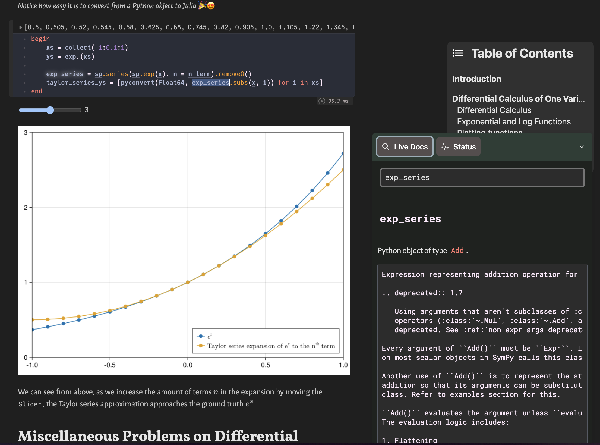
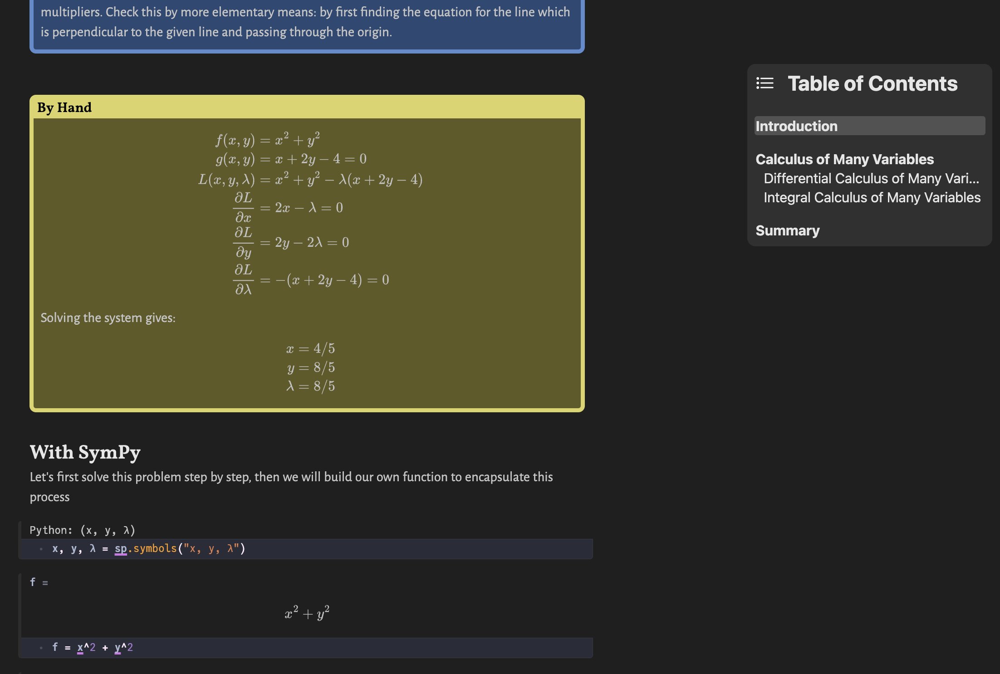

# IntroMathMethods

Contains a collection of Pluto notebooks for the course [PHYSICS 208. Math Methods](https://catalogue.uci.edu/allcourses/physics/) at UCI. This is meant to be a refresher course on basic math concepts for the graduate physics program.

All the notebooks attempt to solve the problems (1) by hand using Markdown/Latex and then (2) with the use of [PythonCall.jl](https://github.com/cjdoris/PythonCall.jl) and [SymPy](https://www.sympy.org/en/index.html). The notebooks main purpose is to solve the given homework problems, but they might contain some notes along the way (plus potential visualizations and explainers).

## See Pluto.jl and PythonCall.jl/SymPy in Action
### Live docs & interactive

### Seamless Mix of Latex, Markdown, Julia Syntax, and More
